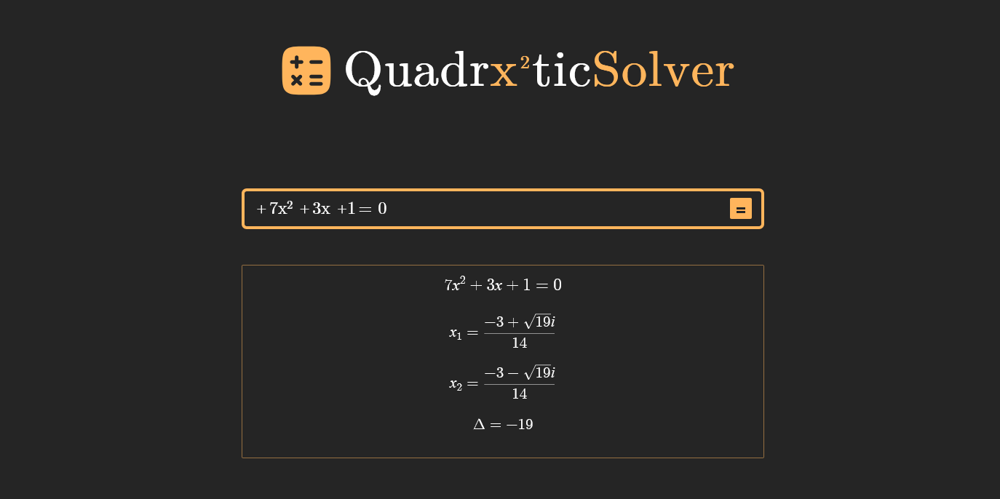

# Quadratic Solver

A web application for solving quadratic equations with a focus on **exact symbolic results** (fractions and simplified radicals), rather than decimal approximations.

---

## 📌 Overview

This project was developed as a study and experimentation tool to explore:

- Mathematical computation in JavaScript
- UI/UX design for structured input
- Separation between logic and presentation
- Symbolic simplification techniques

Instead of behaving like a typical calculator, this application aims to present results in a way that is closer to **academic mathematical notation**.

---

## Preview


Live Demo: https://samuel-fsilva.github.io/Quadratic-Solver/

---
## 🧠 Key Features

### ✔ Structured Input System
- The equation is built using multiple inputs:
  - Signs (+ / −)
  - Coefficients (a, b, c)
  - Variables
- These inputs are visually combined to resemble a single expression: $ax^{2} + bx + c = 0$


**Why this approach?**
- Avoids complex string parsing
- Reduces invalid input cases
- Gives the user more precise control

---

### ✔ Exact Mathematical Results
- No decimal approximations
- Results are expressed as:
- Simplified fractions
- Simplified radicals (e.g., $\sqrt{72} → 6\sqrt{2}$)
- Complex numbers when $\Delta < 0$

---

### ✔ LaTeX Rendering
- Outputs are formatted using LaTeX
- Provides clean, readable mathematical expressions
- Improves clarity and presentation

---

### ✔ UX-Oriented Details
- Coefficients equal to `1` are not removed
- Instead, they are visually de-emphasized (gray color)
- Preserves editability while keeping notation clean
- The interface mimics natural math notation while remaining fully structured internally

---

## ⚙️ Architecture

The project is organized into distinct logical layers:

### 1. Input Layer (UI)
Handles user interaction through structured fields:
- Signs
- Coefficients
- Variables

---

### 2. Math Engine (Core Logic)

Reusable functions responsible for computation:

#### ➤ Quadratic Solver
Implements the quadratic formula: $x = \frac{-b ± \sqrt{b² - 4ac}}{2a} $

- Handles:
  - Two real roots
  - One real root
  - Complex roots

---

#### ➤ GCD (MDC)
- Simplifies fractions to lowest terms

---

#### ➤ Square Root Simplifier
- Extracts perfect square factors

Example: $\sqrt{72} → 6\sqrt{2}$

---

### 3. Representation Layer

- Converts results into LaTeX format
- Ensures mathematical correctness and readability

---

## 🧪 Example

Input: $12x^{2} + 6x + 7 = 0$

Output: $\frac{-3 ± 5 \sqrt{3}i}{12}$

With: $\Delta = -300$


---

## 🚀 Possible Improvements

- Graphing the parabola
- Step-by-step solution breakdown
- Support for higher-degree equations
- More advanced symbolic manipulation
- Export results (PDF, image, etc.)

---

## 🎯 Purpose

This project is not just a calculator—it is an attempt to build a **small symbolic math system**, focusing on:

- Exact computation
- Clean architecture
- Thoughtful user experience

---

## 📚 What I Learned

- Structuring UI to simplify logic
- Separating computation from presentation
- Implementing mathematical simplification algorithms
- Designing for both usability and correctness

---

## 🛠 Tech Stack

- HTML
- CSS
- JavaScript
- LaTeX rendering library (LaTeX.js)

---

## Project Structure

```
project/
│── css/
│   └── styles.css
│── fonts/
│   └── latinmodern-math.otf
│── images/
│   └── calculator.svg
│   └── go-forward.svg
│   └── screenshot.png
│── js/
│   └── app.js
│   └── calc.js
│   └── dom.js
│   └── validation.js
│── index.html
│── 
│── README.md
```

---

## 📄 License
This project is open for learning purposes. Feel free to explore and modify.
## Author

GitHub: https://github.com/samuel-fsilva

## Author

GitHub: https://github.com/samuel-fsilva
